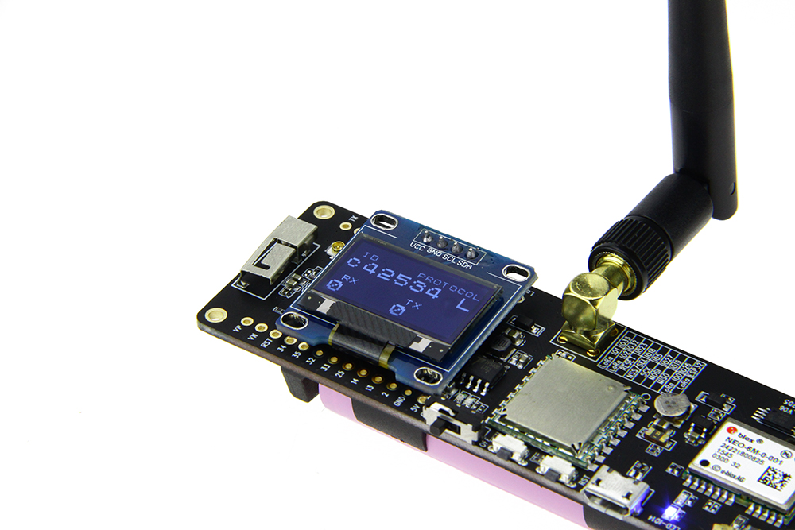
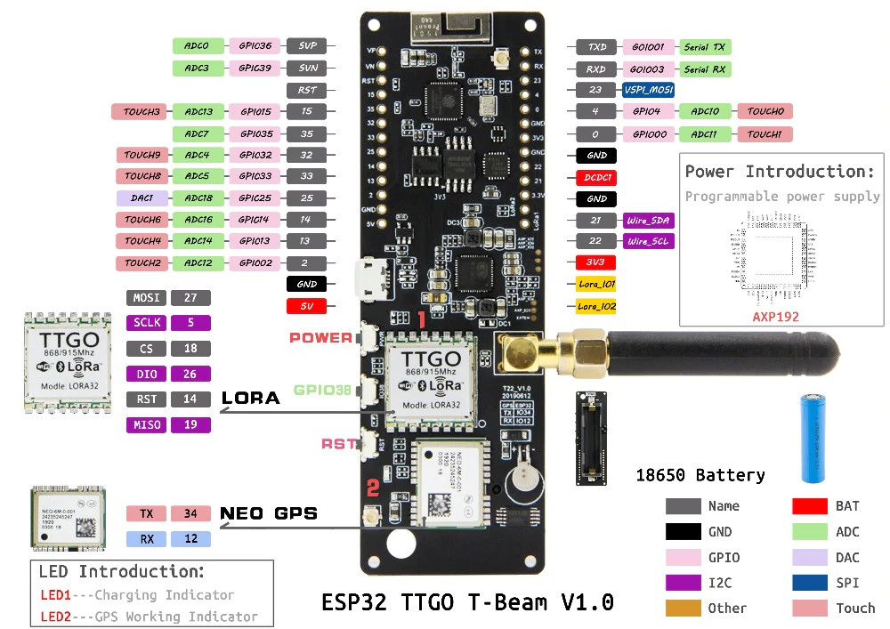
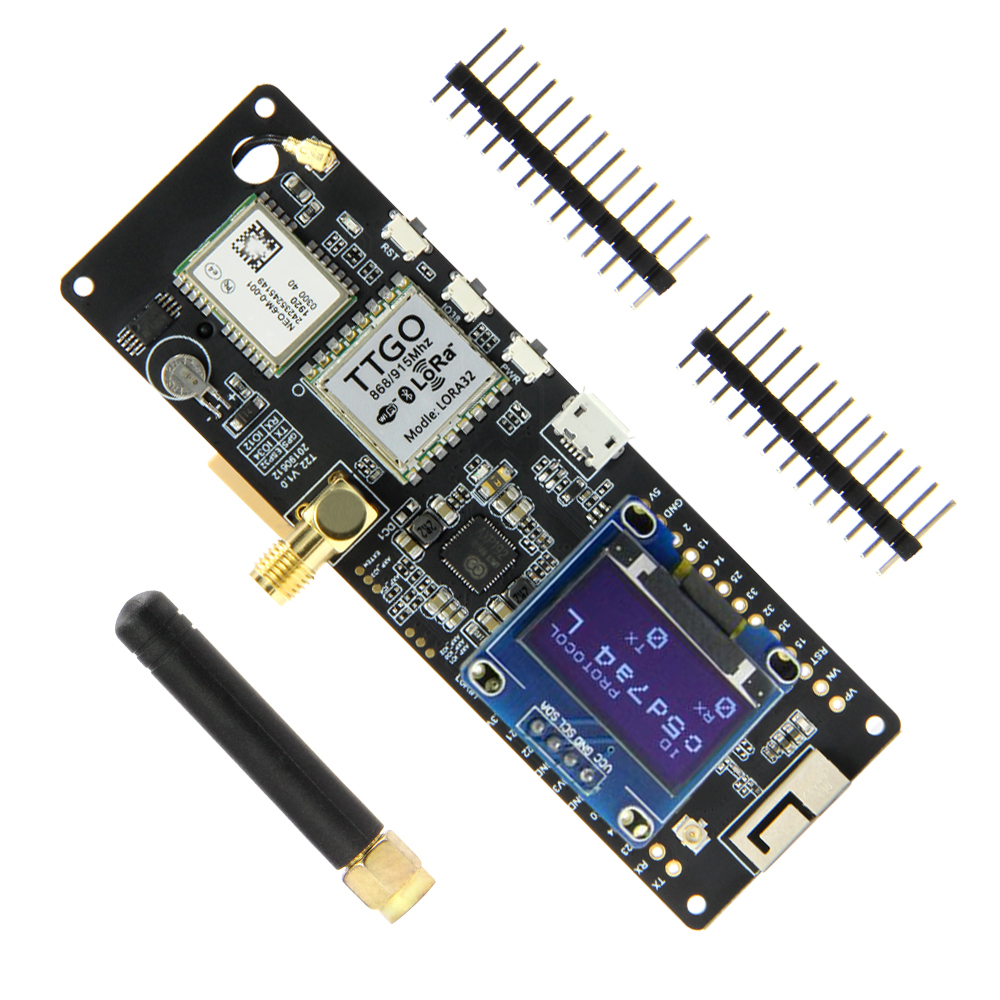

## TTGO T-Beam Tracker for The Things Network

Current version: 1.2.1

Uploads GPS data from the TTGO T-Beam to [The Things Network](https://www.thethingsnetwork.org) (TTN) and [TTN Mapper](https://ttnmapper.org) for tracking and determining signal strength of LoRaWAN gateways and nodes.

#### Based on the code from [xoseperez/ttgo-beam-tracker](https://github.com/xoseperez/ttgo-beam-tracker), with excerpts from [dermatthias/Lora-TTNMapper-T-Beam](https://github.com/dermatthias/Lora-TTNMapper-T-Beam) to fix an issue with incorrect GPS data being transmitted to The Things Network. I also added support for the 915 MHz frequency (North and South America). [lewisxhe/TTGO-T-Beam](https://github.com/lewisxhe/TTGO-T-Beam) was referenced for enabling use on the newer T-Beam board (Rev1).

This is a LoRaWAN node based on the [TTGO T-Beam](https://github.com/LilyGO/TTGO-T-Beam) development platform using the SSD1306 I2C OLED display.
It uses a RFM95 by HopeRF and the MCCI LoRaWAN LMIC stack. This sample code is configured to connect to The Things Network using the US 915 MHz frequency by default, but can be changed to EU 868 MHz.

NOTE: There are now 2 versions of the TTGO T-BEAM, the first version (Rev0) and a newer version (Rev1). The GPS module on Rev1 is connected to different pins than Rev0. This code has been successfully tested on REV0, and is in the process of being tested on REV1. See the end of this README for photos of eah board.

### Setup

1. Follow the directions at [espressif/arduino-esp32](https://github.com/espressif/arduino-esp32) to install the board to the Arduino IDE and use board 'T-Beam'.

2. Install the Arduino IDE libraries:

   * [mcci-catena/arduino-lmic](https://github.com/mcci-catena/arduino-lmic) (for Rev0 and Rev1)
   * [mikalhart/TinyGPSPlus](https://github.com/mikalhart/TinyGPSPlus) (for Rev0 and Rev1)
   * [ThingPulse/esp8266-oled-ssd1306](https://github.com/ThingPulse/esp8266-oled-ssd1306) (for Rev0 and Rev1)
   * [lewisxhe/AXP202X_Library](https://github.com/lewisxhe/AXP202X_Library) (for Rev1 only)

3. Edit ```arduino-lmic/project_config/lmic_project_config.h``` and uncomment the proper frequency for your region.

4. Edit this project file ```main/configuration.h``` and select your correct board revision, either T_BEAM_V07 or T_BEAM_V10 (see [T-BEAM Board Versions](#t-beam-board-versions) to determine which board revision you have).

5. Edit this project file ```main/credentials.h``` to use either ```USE_ABP``` or ```USE_OTAA``` and add the Keys/EUIs for your Application's Device from The Things Network.

6. Add the TTN Mapper integration to your Application (and optionally the Data Storage integration if you want to access the GPS location information yourself or use [TTN Tracker](#ttn-tracker), then add the Decoder code:

```C
function Decoder(bytes, port) {
    var decoded = {};

    decoded.latitude = ((bytes[0]<<16)>>>0) + ((bytes[1]<<8)>>>0) + bytes[2];
    decoded.latitude = (decoded.latitude / 16777215.0 * 180) - 90;

    decoded.longitude = ((bytes[3]<<16)>>>0) + ((bytes[4]<<8)>>>0) + bytes[5];
    decoded.longitude = (decoded.longitude / 16777215.0 * 360) - 180;

    var altValue = ((bytes[6]<<8)>>>0) + bytes[7];
    var sign = bytes[6] & (1 << 7);
    if(sign) decoded.altitude = 0xFFFF0000 | altValue;
    else decoded.altitude = altValue;

    decoded.hdop = bytes[8] / 10.0;
    decoded.sats = bytes[9];

    return decoded;
}
```

7. Open this project file ```main/main.ino``` with the Arduino IDE and upload it to your TTGO T-Beam.

8. Turn on the device and once a GPS lock is acquired, the device will start sending data to TTN and TTN Mapper.


### TTN Tracker

I also developed [The Things Network Tracker (TTN-Tracker)](https://github.com/kizniche/ttn-tracker), a web app that pulls GPS data from TTN and displays it on a map in real-time (TTN Mapper is not real-time) that can be displayed on your phone, tablet, or computer. This is handy for testing signal range while driving, as you can see location points appearing under your moving location dot on the map (if you grant location sharing permissions to the web app) when a successful transmission has been achieved.

### T-BEAM Board Versions

#### Rev0




#### Rev1




