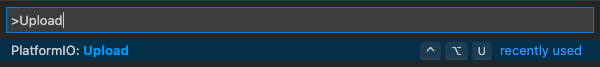
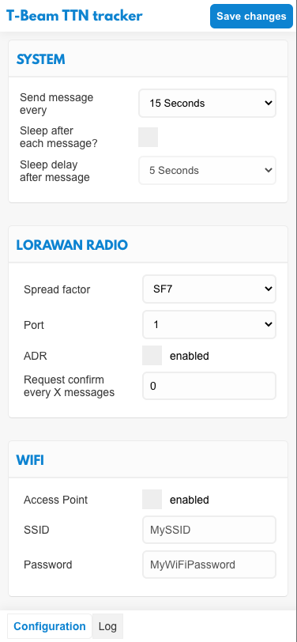

# TTGO T-Beam Tracker for The Things Network

Current version: 2.0.0

Uploads GPS data from the TTGO T-Beam to [The Things Network](https://www.thethingsnetwork.org) (TTN) and [TTN Mapper](https://ttnmapper.org) for tracking and determining signal strength of LoRaWAN gateways and nodes.

Based on the code from [xoseperez/ttgo-beam-tracker](https://github.com/xoseperez/ttgo-beam-tracker), with excerpts from [dermatthias/Lora-TTNMapper-T-Beam](https://github.com/dermatthias/Lora-TTNMapper-T-Beam) to fix an issue with incorrect GPS data being transmitted to The Things Network. I also added support for the 915 MHz frequency (North and South America). [lewisxhe/TTGO-T-Beam](https://github.com/lewisxhe/TTGO-T-Beam) was referenced for enabling use on the newer T-Beam board (Rev1).

This is a LoRaWAN node based on the [TTGO T-Beam](https://github.com/LilyGO/TTGO-T-Beam) development platform using the SSD1306 I2C OLED display.
It uses a RFM95 by HopeRF and the MCCI LoRaWAN LMIC stack. This sample code is configured to connect to The Things Network using the US 915 MHz frequency by default, but can be changed to EU 868 MHz.

To ease the configuration of the device. This firmware has been extended to provide a configuration UI via the ESP32's
embedded WiFi functionality. By default, the device opens a new AccessPoint and can be configured by connecting to its
configuration web page by accessing `http://192.168.4.1`.

**NOTE:** There are now 2 versions of the TTGO T-BEAM, the first version (Rev0) and a newer version (Rev1). The GPS module on Rev1 is connected to different pins than Rev0. This code has been successfully tested on REV0, and is in the process of being tested on REV1. See the end of this README for photos of eah board.

## Setup

1. Pull this repository into a location of your choice and open it as PlatformIO project

2. Edit the project's `platformio.ini` and select the correct LoRaWAN frequency plan for the region you live in:

   - `CFG_eu868` _(default)_
   - `CFG_us915`
   - `CFG_au915`
   - `CFG_as923`
   - `CFG_kr920`
   - `CFG_in866`

3. Edit this project's `main/configuration.h` file and select your correct board revision, either T_BEAM_V07 or T_BEAM_V10 (see [T-BEAM Board Versions](#t-beam-board-versions) to determine which board revision you have).

4. Edit this project's `main/credentials.h` file to use either `USE_ABP` or `USE_OTAA` and add the Keys/EUIs for your Application's Device from The Things Network.

   **Note:** These values will be changeable using the web interface in future releases

5. Add the TTN Mapper integration to your Application (and optionally the Data Storage integration if you want to access the GPS location information yourself or use [TTN Tracker](#ttn-tracker), then add the Decoder code:

   ```C
   function Decoder(bytes, port) {
       var decoded = {};

       decoded.latitude = ((bytes[0]<<16)>>>0) + ((bytes[1]<<8)>>>0) + bytes[2];
       decoded.latitude = (decoded.latitude / 16777215.0 * 180) - 90;

       decoded.longitude = ((bytes[3]<<16)>>>0) + ((bytes[4]<<8)>>>0) + bytes[5];
       decoded.longitude = (decoded.longitude / 16777215.0 * 360) - 180;

       var altValue = ((bytes[6]<<8)>>>0) + bytes[7];
       var sign = bytes[6] & (1 << 7);
       if(sign) decoded.altitude = 0xFFFF0000 | altValue;
       else decoded.altitude = altValue;

       decoded.hdop = bytes[8] / 10.0;
       decoded.sats = bytes[9];

       return decoded;
   }
   ```

6. Build and upload the project to your TTGO T-Beam using PlatformIO

   This can either be done by using the `PlatformIO: Upload` command within VSCode<br>
   <br>
   or by using the command

   ```shell
   pio run --target upload
   ```

   from within the project's root directory.

7. Upload the web configuration files into the TTGO T-Beam's SPIFFS data partition. This can be done by running

   ```shell
   pio run --target uploadfs
   ```

   from within the project's root directory

8. Turn on the device and once a GPS lock is acquired, the device will start sending data to TTN and TTN Mapper.

## Configuration UI

## TTN Tracker

I also developed [The Things Network Tracker (TTN-Tracker)](https://github.com/kizniche/ttn-tracker), a web app that pulls GPS data from TTN and displays it on a map in real-time (TTN Mapper is not real-time) that can be displayed on your phone, tablet, or computer. This is handy for testing signal range while driving, as you can see location points appearing under your moving location dot on the map (if you grant location sharing permissions to the web app) when a successful transmission has been achieved.

## T-BEAM Board Versions

By default, the devices creates an Access Point with the SSID `T-Beam Mapper` and the password `changeme`. If cou connect to it, enter the following URL into your browser to open the configuration web UI:

```
http://192.168.4.1
```

There you can configure the device and its behavior. By clicking the `log` menu item on the bottom, you can switch to a
viewer that shows the latest log outputs the device has written.

Disabling WiFi in the Web UI will disable the creation of the access point on device bootup (which is the default).
You can always re-enable it by pressing the "select" button (the one in the middle). When WiFi is enabled, pressing
this button will disable it.

Pressing the "select" button for more than three seconds will delete the TTN preferences and restart the device.



### Rev0


### Rev1


